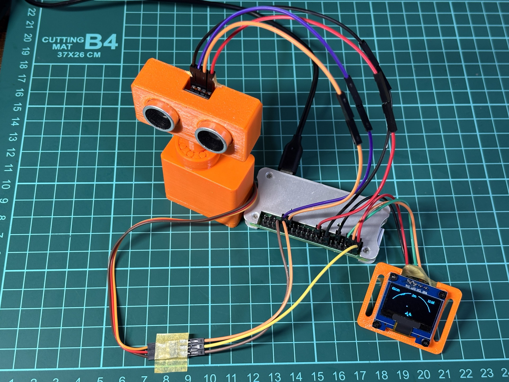

# Raspberry Pi Zero 2 W HC-SR04 OLED Radar

Raspberry Pi Zero 2 W、HC-SR04系超音波距離センサー、SG90サーボ、SSD1306 OLEDを使った走査レーダーです。完成版のVer4は実機で動作確認済みです。



## デモ動画

### レーダー走査とOLED表示

[](https://www.youtube.com/watch?v=QK99JPKq6U8)

### OLED表示のクローズアップ（Short）

[](https://www.youtube.com/shorts/qSEfqi-cBqI)

サムネイルをクリックするとYouTubeで再生します。動画はGit履歴へ含めず、原動画は[Release v1.0.0-radar-demo](https://github.com/zorosdrone/pi-zero-hcsr04-oled-radar/releases/tag/v1.0.0-radar-demo)の添付ファイルとしても配布します。

## 主な仕様

- 走査角度: 30〜150度
- 走査刻み: 3度
- 測距間隔: 75ms以上
- 表示範囲: 2m
- 表示: SSD1306 I²C OLED
- 実測: 片道約3秒
- 終了時: サーボを90度へ戻してPWMを解除

## 確認状態

| 項目 | 状態 |
|---|---|
| HC-SR04単体測距 | 実機確認済み |
| SSD1306表示 | 実機確認済み |
| SG90 30〜150度走査 | 実機確認済み |
| Ver4統合動作 | 実機確認済み |
| 別個体のHC-SR04・SG90 | 個体ごとの再確認が必要 |
| 長時間連続運転・自動起動 | 未検証 |

## はじめに

配線前に[安全上の注意](SAFETY.md)を読み、[部品表](BOM.md)と[セットアップ手順](docs/setup.md)を確認してください。

完成版はRaspberry Pi上で次のように実行します。

```bash
python3 src/hc_sr04_radar_test_v4.py
```

停止は`Ctrl+C`です。

## ファイル構成

- `src/`: 完成版Ver4、距離測定、サーボ校正、固定OLED表示の確認用スクリプト
- `examples/oled/`: OLED単体確認
- `assets/`: 配線図、構成図、実機写真
- `media/`: Release添付用のデモ動画とリリースノート
- `docs/`: セットアップと再現手順

## GPIO割り当て

| 機器 | 信号 | BCM GPIO | 物理ピン |
|---|---|---:|---:|
| SSD1306 | SDA | GPIO2 | 3 |
| SSD1306 | SCL | GPIO3 | 5 |
| HC-SR04 | TRIG | GPIO5 | 29 |
| HC-SR04 | ECHO | GPIO6 | 31 |
| SG90 | PWM | GPIO12 | 32 |

この割り当ては本機の構成です。ECHO電圧とサーボ電源については[安全上の注意](SAFETY.md)を優先してください。

## 3Dプリントモデル

SG90サーボの固定ケースには、MakerWorldの[SG90 Servo Case Gen2](https://makerworld.com/ja/models/2088712-sg90-servo-case-gen2#profileId-2257653)を使用しています。モデルデータは本リポジトリには含めません。使用条件と印刷設定は配布元で確認してください。

## ライセンス

- `src/`、`examples/`、`scripts/` の自作コード: [MIT License](LICENSE)
- 自作の文書、図、写真、およびGitHub Releaseに添付する自作デモ動画: [CC BY 4.0](LICENSE-DOCUMENTATION.md)
- 依存パッケージ・外部参照資料・同梱していない素材: [NOTICE.md](NOTICE.md) を参照
